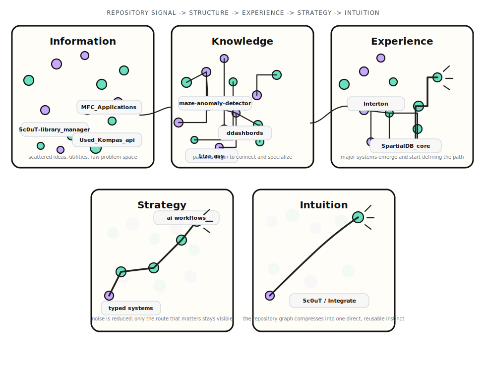

<h1 align="center">5c0uT / Integrate</h1>

  <code>building typed tools, infrastructure-heavy systems, and applied AI workflows</code>

  Public repositories show the structure; a meaningful share of the production work stays private.

  
  
  
  

  
  

---

## `> current_focus`

  <code>building language tooling and structured developer workflows</code> 
  <code>refining infrastructure-heavy systems for data and compute workloads</code> 
  <code>shipping applied AI automation across public and private engineering work</code>

---

## `> skills`

<code>languages</code>

  
  

<code>runtime / frameworks</code>

  

<code>systems / compute</code>

  

  
  
  
  
  
  

<code>data / storage</code>

  

<code>tooling / workflow</code>

  

---

## `> featured_projects`

  public projects that map the current engineering direction most clearly

| `Interton`                                                                                                                                                                                                                                                                                                                                                                                |
| ----------------------------------------------------------------------------------------------------------------------------------------------------------------------------------------------------------------------------------------------------------------------------------------------------------------------------------------------------------------------------------------- |
| Programming language project built around a typed core, standard modules, and domain-specific stacks.                                                                                                                                                                                                                                                                                     |
| Designed as a structured entry point for technical development where modularity, language design, and practical integration stay first-class.                                                                                                                                                                                                                                             |
|    |
|                                                                                                                                                                                                                               |

 

| `SpartialDB_core`                                                                                                                                                                                                                                                                                                                                                                     |
| ------------------------------------------------------------------------------------------------------------------------------------------------------------------------------------------------------------------------------------------------------------------------------------------------------------------------------------------------------------------------------------- |
| High-performance 3D spatial data system designed for geospatial workloads with GPU-accelerated processing.                                                                                                                                                                                                                                                                            |
| Built closer to infrastructure and computation than UI, with emphasis on throughput, spatial data handling, and engineering for scale.                                                                                                                                                                                                                                                |
|    |
|                                                                                                                                                                                                                    |

---

## `> logic_map`

  <code>raw signal -> structure -> experience -> strategy -> intuition</code>

  

  one compressed map of repository signals, system paths, and integration direction

---

## `> stats`

  <picture>
    <source media="(prefers-color-scheme: dark)" srcset="https://raw.githubusercontent.com/5c0uT/5c0uT/main/generated/overview.svg" />
    <source media="(prefers-color-scheme: light)" srcset="https://raw.githubusercontent.com/5c0uT/5c0uT/main/generated/overview.svg" />
    
  </picture>

  <picture>
    <source media="(prefers-color-scheme: dark)" srcset="https://raw.githubusercontent.com/5c0uT/5c0uT/main/generated/languages.svg" />
    <source media="(prefers-color-scheme: light)" srcset="https://raw.githubusercontent.com/5c0uT/5c0uT/main/generated/languages.svg" />
    
  </picture>

  <picture>
    <source media="(prefers-color-scheme: dark)" srcset="https://streak-stats.demolab.com?user=5c0uT&theme=dark&hide_border=true&background=0d1117&border=0d1117&stroke=2a2f38&ring=39d353&fire=39d353&currStreakNum=39d353&sideNums=9be9a8&currStreakLabel=c9d1d9&sideLabels=8b949e&dates=8b949e" />
    <source media="(prefers-color-scheme: light)" srcset="https://streak-stats.demolab.com?user=5c0uT&theme=default&hide_border=true&background=f6fff8&border=f6fff8&stroke=d8dee4&ring=2f855a&fire=2f855a&currStreakNum=2f855a&sideNums=22543d&currStreakLabel=1a202c&sideLabels=4a5568&dates=4a5568" />
    
  </picture>

  

---

## `> contribution_trace`

  <picture>
    <source media="(prefers-color-scheme: dark)" srcset="https://raw.githubusercontent.com/5c0uT/5c0uT/refs/heads/output/github-contribution-grid-snake-dark.svg" />
    <source media="(prefers-color-scheme: light)" srcset="https://raw.githubusercontent.com/5c0uT/5c0uT/refs/heads/output/github-contribution-grid-snake.svg" />
    
  </picture>

